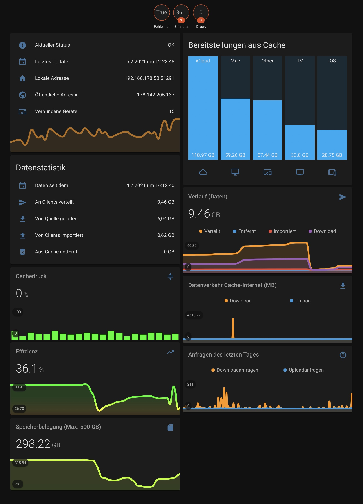

# HA-macOS-ContentCache-Statistic-viewer

Implementation for apple content cache statistics in home assistant using node-red an the cli tools for the build-in caching server

[What is a content caching server on macOS?](https://support.apple.com/guide/mac-help/what-is-content-caching-on-mac-mchl9388ba1b/11.0/mac/11.0)

## Requirements for Caching-Server-Mac
- nmap
- Running node-red Instance
- enabled Caching Service

## Other Requirements
- Running Home Assistant Instance (Local or Network)
- Installed [HACS-Store](https://hacs.xyz/docs/installation/prerequisites) in Home Assistant
- Installed custom [Bar Card](https://github.com/custom-cards/bar-card.git)
- Installed custom [mini-graph-card](https://github.com/kalkih/mini-graph-card)

## Installation for Caching-Server-Mac
1. Open up your Browser and navigate to your Node-Red configuration website.
2. Install the [node-red-contrib-home-assistant-websocket](https://flows.nodered.org/node/node-red-contrib-home-assistant-websocket) - Nodes
3. Import the nodes from [node-red/IMPORT_THIS.json](https://github.com/MrDrache333/macOS-ContentCache-Statistic-viewer/blob/main/node-red/IMPORT_THIS.json)
4. Configure your HomeAssistant Instance in every Node. For this, you can create a access-token in your HomeAssistant instance. Open up your HomeAssistant instance in your Browser, navigate to your Profile and scroll down to the bottom. There you have the possiblity to create the Access-Token you need for node-red.

## Installation for Home Assitant
1. Import the 'Apple Cache'-Tab i've preconfigured from [home-assistant/lovelace-tab.yaml](https://github.com/MrDrache333/macOS-ContentCache-Statistic-viewer/blob/main/home-assistant/lovelace-tab.yaml) to your lovelace dashboard. To do so edit your lovelace dashboard and klick on the three dots in the right hand corner and select 'Edit in RAW-Mode'. Paste the yaml-File-Content at the and and save your configuration

